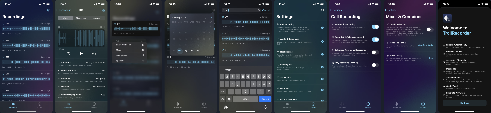

# TrollRecorder

Not the first, but the best phone call recorder with [TrollStore](https://ios.cfw.guide/installing-trollstore/).

[now-on-havoc]: https://havoc.app/package/trollrecorder

[][now-on-havoc]

- Supports iOS 15.0 to iOS 17.0
- No iOS 14 support.

#### Jailbreak Version

Popular jailbreaks are also supported. Get [TrollRecorder JB](https://havoc.app/package/trollrecorderjb).

- Rootless jailbreaks: [Dopamine](https://github.com/opa334/Dopamine) / [palera1n](https://palera.in/)
- Legacy jailbreaks: [unc0ver](https://unc0ver.dev/) / [checkra1n](https://checkra.in/)

#### About Other Installation Methods

- There're no additional support for RootHide. Use TrollStore version instead.
- [eSign](https://twitter.com/EsignPatch) or [LiveContainer](https://github.com/khanhduytran0/LiveContainer) are not supported due to their own limitations.

## Pro Version

Core features of TrollRecorder are free to use. You can buy a Pro license to unlock advanced features.  
Paid licenses are valid for lifetime, and up to 5 devices.

## 1.x Milestones

- [x] <del>Hover-ball on Lockscreen</del> Notification on Lockscreen
- [ ] Network Storage
  - [ ] iCloud Backup
  - [ ] iCloud Drive
  - [ ] Google Drive
  - [ ] Dropbox

## 2.x Milestones

A botch job is a waste of time. That's why we always built our app in the best quality.

- [ ] Record System Audio (What You Hear)
- [ ] Record like Voice Memos
- [ ] Built-In Audio Editor

## Video Introduction

## Special Thanks

- [AudioRecorder XS](https://limneos.net/audiorecorderxs/), [User Interface without SpringBoard](https://github.com/limneos/UIDaemon) and [iOS Runtime Headers](https://developer.limneos.net/) by [@limneos](https://twitter.com/limneos), one of my favourite developer.
- [CallAssist](https://buy.htv123.com) by [@xybp888](https://github.com/xybp888)
- [LearnAudioToolBox](https://github.com/liuxinxiaoyue/LearnAudioToolBox) by [@liuxinxiaoyue](https://github.com/liuxinxiaoyue)

## Translators

- Spanish by [@Deci8BelioS](https://github.com/Deci8BelioS)
- French by [@DzMoha](https://twitter.com/contact_nadhir)
- Traditional Chinese (Hong Kong) by [@CaslenZ](https://github.com/CaslenZ)
- Traditional Chinese (Taiwan) by [@雲端戰神一刀秒](https://github.com/mp614t)
- Vietnamese by [@2311WithLuv](https://www.facebook.com/If2019)

## Localization

At least, you need to provide `Localizable.strings` and `InfoPlist.strings`. Example: [Localizable.strings](https://github.com/Lessica/TrollRecorder/blob/main/res/en.lproj/Localizable.strings).

## License

The core of TrollRecorder (command line tool / CLI), and only itself, is open-sourced here.

The command line tools of TrollRecorder are [Free Software](https://www.gnu.org/philosophy/free-sw.html) licensed under the [GNU General Public License](LICENSE).
