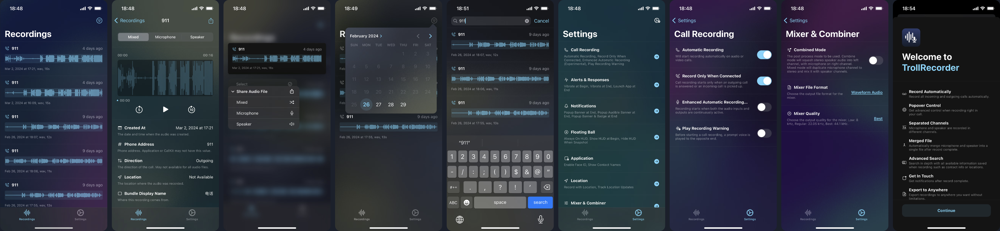

# TrollRecorder

Not the first, but the best phone call recorder with [TrollStore](https://ios.cfw.guide/installing-trollstore/).

[now-on-havoc]: https://havoc.app/package/trollrecorder

[][now-on-havoc]

- Supports iOS 15.0 to iOS 17.0
- **No iOS 14 support.**

## Jailbreak Version

Popular jailbreaks are also supported. Get [TrollRecorder JB](https://havoc.app/package/trollrecorderjb).

- [RootHide](https://github.com/roothide/Dopamine2-roothide)
- [Dopamine](https://github.com/opa334/Dopamine) / [palera1n](https://palera.in/)

## ⚠️ Not Supported

- There is no additional support for [Bootstrap (RootHide)](https://github.com/roothide/Bootstrap) nor [NathanLR](https://github.com/verygenericname/nathanlr).
  - Use TrollStore version instead.
- [eSign](https://twitter.com/EsignPatch) or [LiveContainer](https://github.com/khanhduytran0/LiveContainer) are not supported due to their own limitations.

## Pro Version

Core features of TrollRecorder are free to use. You can buy a Pro license to unlock advanced features.  
Paid licenses are valid for lifetime, and up to 5 devices.

## Special Thanks

- [TrollStore](https://github.com/opa334/TrollStore) and [Dopamine](https://github.com/opa334/Dopamine) by [@opa334dev](https://twitter.com/opa334dev)
- [AudioRecorder XS](https://limneos.net/audiorecorderxs/) by [@limneos](https://twitter.com/limneos)
- [CallAssist](https://buy.htv123.com) by [@xybp888](https://github.com/xybp888)

## Translators

Except for English and Simplified Chinese, all other localizations were generated or reviewed by DeepSeek v4. Some source text was provided by volunteer translators listed below.

- Spanish source text by [**@Deci8BelioS**](https://github.com/Deci8BelioS)
- French source text by [**DzMoha**](https://twitter.com/contact_nadhir)
- Korean source text by **SUB2**
- Russian source text by [**RAYMONCE**](https://t.me/raymonce)
- Turkish source text by [**Altay T.**](https://x.com/yamenhuu)
- Uyghur source text by **BlacЖinG**
- Vietnamese source text by [**@romlayvn-0411**](https://github.com/romlayvn-0411) and [**2311WithLuv**](https://www.facebook.com/If2019)
- Traditional Chinese (Hong Kong) source text by [**@CaslenZ**](https://github.com/CaslenZ)
- Traditional Chinese (Taiwan) source text by [**雲端戰神一刀秒**](https://github.com/mp614t)

## Localization

At minimum, a localization should include `Localizable.strings` and `InfoPlist.strings`. Example: [Localizable.strings](https://github.com/Lessica/TrollRecorder/blob/main/res/en.lproj/Localizable.strings).

**🙇 PLEASE HELP REVIEW LLM-GENERATED LOCALIZATIONS!**

## Privacy Policy

See [Privacy Policy](./PrivacyPolicy.md).

## End-User License Agreement

See [E.U.L.A.](./EULA.md).

## License

The core of TrollRecorder (command line tool / CLI), and only itself, is open-sourced here.

The command line tools of TrollRecorder are [Free Software](https://www.gnu.org/philosophy/free-sw.html) licensed under the [GNU General Public License](LICENSE).

## 解锁全部功能

- 🌟 超过 50 个高级功能
- 🌟 绑定 Havoc 账号，在多达 5 台设备上同时使用
- 🌟 无订阅，无额外付费，一次购买终身可用
- 🌟 安全的支付方式
- 🌟 精英群技术支持

➡️ [购买巨魔版](https://havoc.app/package/trollrecorder) ➡️ [购买越狱版](https://havoc.app/package/trollrecorderjb)

### 免费版 vs 正式版

| 功能 | 免费版 | 正式版 | 备注 |
|------|------|------|------|
| 　 语音备忘录 | 　✅ | 　✅ | 录制环境音 |
| 　 基础通话录音 | 　✅ | 　✅ | 电话与 FaceTime 录音 |
| 　 CallKit 录音 | 　✅ | 　✅ | 支持 CallKit 的第三方 App 录音 |
| 　 微信和其他 App 录音 | 　✅ | 　✅ | 非 CallKit 的第三方 App 录音 |
| 　 系统音频录制 | | 　✅ | 录制设备发出的声音 |
| 👍 微信通话助理 | | 　✅ | 获取并显示微信的联系人备注 |
| 👍 首次解锁后启动 | | 　✅ | 需将小组件添加到锁定屏幕或主屏幕 |
| 👍 稳定持久不漏录 | | 　✅ | 需将小组件添加到锁定屏幕或主屏幕 |
| 👍 优秀的功耗控制 | 　✅ | 　✅ | 基于事件驱动，对续航影响极小 |
| 　 通知与提醒 | 　✅ | 　✅ | 振动、触感反馈和推送通知 |
| 　 位置服务 | 　✅ | 　✅ | 记录录音时的地理位置 |
| 　 悬浮球 | 　✅ | 　✅ | 精美的服务和录音状态指示器 |
| 　 悬浮球+ | | 　✅ | 自定义悬浮球尺寸、样式和效果 |
| 　 显示与外观 | | 　✅ | 多点图标，多点新意 |
| 　 自定义分享 | | 　✅ | 分享录音时携带详细信息，自定义文件名称 |
| 　 回收站 | | 　✅ | 世上没有后悔药，但我们有 |
| 👍 个人收藏/过期清理 | | 　✅ | 小容量 iPhone 的福音 |
| 👍 智能云归档 | | 　✅ | 充分利用 iCloud 云盘归档过往录音 |
| 👍 通过 iCloud 备份 | | 　✅ | 跟随 iCloud 整机增量备份 |
| 👍 组合模式/保留通道 | | 　✅ | 分别保留和听取扬声器和麦克风通道 |
| 　 多种文件和音频格式 | | 　✅ | 支持 m4a/caf/wav，支持 aac 编码 |
| 　 自定义采样率 | | 　✅ | 更好的音频质量 |
| 　 触控/面容 ID | | 　✅ | |
| 　 隐秘语音备忘录 | | 　✅ | 让语音备忘录保持隐身录制 |
| 　 电话/联系人联动 | | 　✅ | 仅越狱版提供，在「最近通话」中查看关联录音 |
| 　 更多网络存储 | | 　✅ | Google Drive / Microsoft OneDrive / Dropbox |

### 巨魔版 vs 越狱版

| 功能 | 巨魔版 | 越狱版 | 备注 |
|------|------|------|------|
| 稳定持久不漏录 | 　✅ | 　✅ | |
| 首次解锁后启动 | 　✅ | | 需将小组件添加到锁定屏幕或主屏幕 |
| 越狱后自启动 | | 　✅ | |
| 隐秘语音备忘录 | 　✅ | 　✅ | 让语音备忘录保持隐身录制 |
| 电话/联系人联动 | | 　✅ | 在「最近通话」中查看关联录音 |

### 智能云归档 vs 通过 iCloud 备份

| 特性 | 智能云归档 | 通过 iCloud 备份 |
|------|------|------|
| 位置 | iCloud 云盘 | iCloud 备份 |
| 前提条件 | ✅ iCloud 套餐空间足够 ✅ 设置 -> Apple ID -> iCloud -> 打开「iCloud 云盘」 | ✅ iCloud 套餐空间足够 ✅ 设置 -> Apple ID -> iCloud -> 打开「iCloud 云备份」 |
| 开启方式 | App -> 设置 -> 内容共享 -> 打开「智能云归档」 | App -> 设置 -> 本地存储 -> 打开「通过 iCloud 备份」 |
| 范围 | ⚠️ 除当前月份外的所有月份的录音 | ✅ 所有录音 |
| 在「文件」中查看 | ✅ | ✅ |
| 按月整理 | ✅ | ✅ |
| 只增不删 | ✅ | ⚠️ 跟随本地录音增删改 |
| 自定义归档名称 | ✅ | ⚠️ 原始文件名称 |
| 不占用额外存储空间 | ✅ APFS 克隆 | ✅ 硬链接 |

### 网络存储模式

| 模式 | 可恢复 | 描述 |
|------|------|------|
| 归档 | | 使用 “内容共享” → “自定义导出名称” **重命名** 混合和组合模式的本地录音并上传到云盘。你可以在云盘上按月查看、按备注后的文件名搜索录音。被 “归档” 到云盘的录音无法恢复到巨魔录音机 App 当中。 |
| 上传 | ✅ | 将本地录音（包含分离通道）和元数据以初始形态上传到云盘，云盘上的录音 **只增不删**。你可以通过 “双向同步” 或手动迁移将这些录音恢复到巨魔录音机 App 当中。 |
| 同步 | ✅ | 在 “上传” 的基础之上：如果你删除了本地录音，云盘上对应的录音也会被删除（或移动到云盘的回收站）。 |
| 双向同步 | ✅ | 在 “同步” 的基础之上：如果你删除了云盘上的录音，本地对应的录音也会被删除（不会移动到回收站），云盘上的录音和本地始终保持一致。 |
